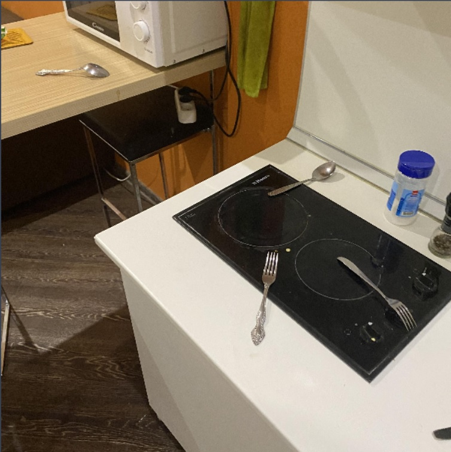
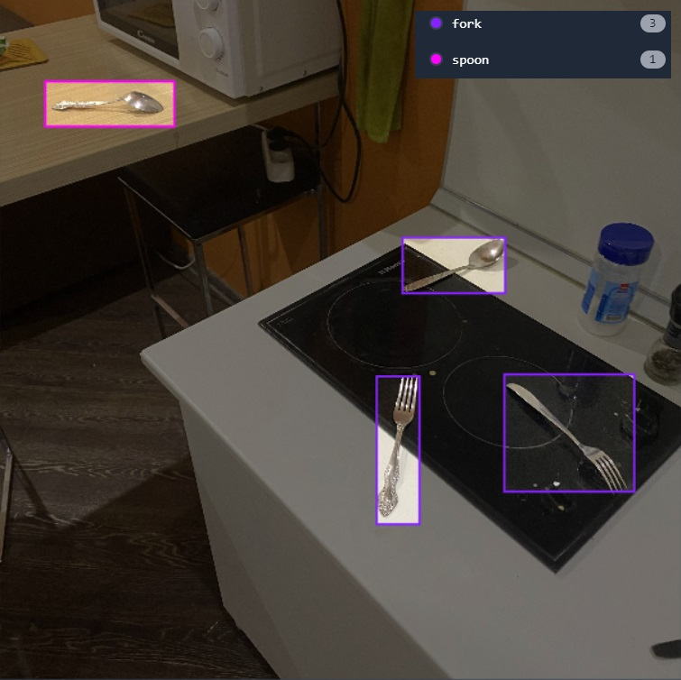
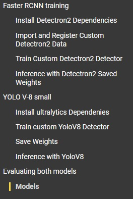

# Applied Machine Learning Assignment 1

## Task description

Train the Faster RCNN and small YOLOv8 for object detection. 
Then evaluating them. 

### Steps 

1. Take photos of your environment of two or more objects. (at least 100 instances between all objects) 

2. Annotate them on roboflow. 

3. Train a Faster RCNN model using detectron2

4. Train Yolov4/5/6/7/8 (only one of them of choice) the smallest size

5. Evaluate both models based on mAP and speed and size.

## Solution

### 1. Firstly I took 105 photo of ```spoons``` and ```forks``` using my smartphone camera.

Example of the photo: 



### 2. Using Roboflow I annotated them. 

Example of the photo: 



After I used Augmentation:

* Flip: Horizontal
* Rotation: Between -15° and +15°
* Blur: Up to 1px

Next step is dividing into ```train/val/test```. 
So, train includes 219 images (87%), val 21 images (8%)
and test 11 images (4%).

The last step is export dataset for the models:

* For Faster RCNN is COCO format with images size 416x416
* For Small YOLOv8 is YOLOv8 format with images size 640x640

### Training process

So, i trained the models using [Google Colab Notebook](https://colab.research.google.com/drive/12EWzPYnV1RHtnxkSolUANxDg5y_D6C7w?usp=sharing).
Please, use the link to check my work.

Here is the structure of my notebook:



* First part is training a Faster RCNN model using detectron2
* Second part is training a Small YOLOv8

### Evaluation process

You can find evaluation of these models in my colab notebook.
All the graphs also included in the notebook.

```
## Faster RCNN

Number of iterations - 1500
Time of execution -  0:50:32
mAP@50 - 0.920
Image size - 416x416


## YoloV8 small

Number of epochs - 100
Time of execution - 0:51:00
mAP@50 - 0.738
Image size - 640x640
```


**Conclusion about the models**: RCNN for my situation give the better result than small YoloV8. As I understand, it occurs, because of their architecture. YOLO has difficulty detecting objects that are small and close to each other. (In my pictures forks and spoons are small and they locate close to each other). Faster RCNN on the other hand, do detect small objects well.


 


